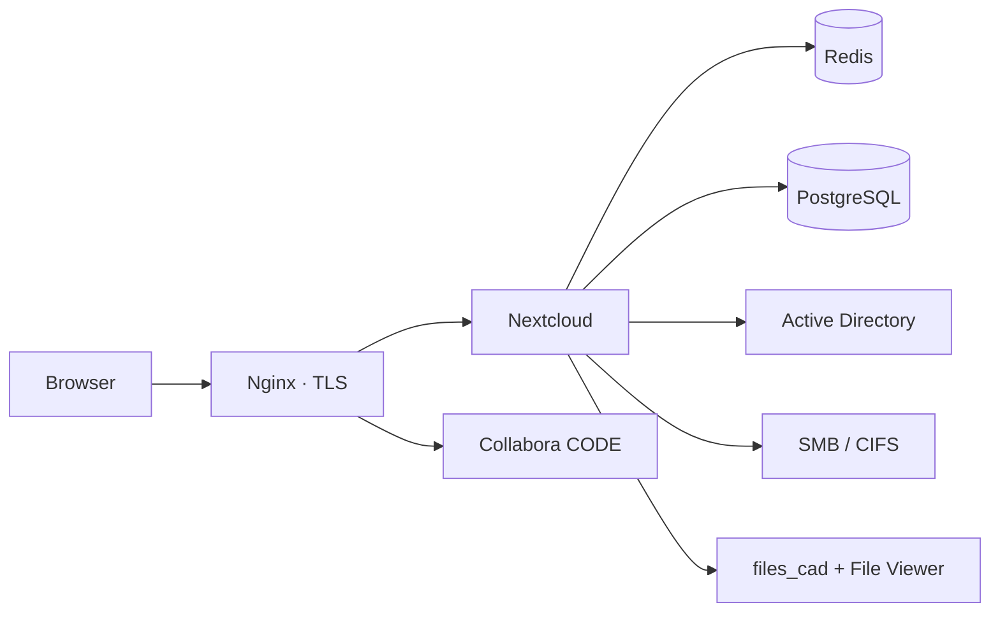

<div align="center">

# docker-nextcloud

**Corporate file cloud on Nextcloud**

Active Directory · SMB · Collabora Online · PostgreSQL · DWG / DXF

[](https://nextcloud.com)
[](https://docs.docker.com/compose/)
[](https://www.postgresql.org)
[](https://www.collaboraoffice.com)
[](LICENSE)

[Documentation](docs/README.md) · [Deploy](docs/deploy.md) · [CAD drawings](docs/cad.md) · [Security](SECURITY.md)

</div>

---

A stack for a company that needs one place for files, office documents, and construction drawings. Users sign in through Active Directory, SMB shares appear as normal folders, Word and Excel open in the browser, and a DWG opens on click — no “Save file” dialog.

The Nextcloud image is built from the [`Dockerfile`](Dockerfile): SMB client and LibreDWG are baked in. A plain `nextcloud:latest` image is not enough for this stack.

## Features

| | |
|---|---|
| **Directory and access** | LDAP / Active Directory, external SMB/CIFS shares, quotas, HTTPS behind a reverse proxy |
| **Documents** | Collabora Online for DOCX, XLSX, PPTX. OnlyOffice is not in the stack |
| **Drawings** | In-browser DWG / DXF / DWF / IFC, AutoCAD icons, thumbnails via LibreDWG |
| **Data** | External PostgreSQL 14–18, Redis for cache and file locks |
| **Operations** | Idempotent `occ` wrappers, runbook for a new host, upgrades, and moves |

## Architecture



| Service | Image | Role |
|---|---|---|
| Nextcloud | `cloud-nextcloud:local` | Files, LDAP, SMB, DWG MIME and thumbnails |
| Redis | `redis:alpine` | Cache and file locks |
| Collabora | `collabora/code` | Online document editor |
| PostgreSQL | external, `docker-lan` | The only database in the stack |

Nginx and TLS are not part of this repository — samples only, in [`nginx/`](nginx/).

## Quick start

You need Docker 24+, Compose v2, the `docker-lan` network, and PostgreSQL 14–18. Nextcloud plus Collabora is comfortable from about 6 GiB RAM.

```bash
docker network create docker-lan   # skip if the network already exists
cp .env.sample .env                # fill in real values, do not keep the sample
docker compose build
docker compose up -d
./scripts/set-basics.sh
```

Then, in this order, with no skips:

```bash
./scripts/set-theming.sh
./scripts/apps-enable.sh
./scripts/set-ldap.sh
./scripts/set-collabora.sh
./scripts/set-cad.sh               # otherwise .dwg downloads as an unknown file
```

Full runbook: [docs/deploy.md](docs/deploy.md). DWG pitfalls: [docs/cad.md](docs/cad.md).

## Repository

```
├── docker-compose.yml
├── Dockerfile                 # Nextcloud + SMB + LibreDWG
├── .env.sample                # secrets belong only in the local .env
├── docs/                      # documentation and runbook
├── nginx/                     # reverse-proxy samples
├── collabora/                 # jail patch for CODE
├── apps/files_cad/            # DWG/DXF thumbnails and fallback viewer
├── cad/                       # drawing MIME types
├── scripts/                   # occ wrappers
├── theming/                   # logo
└── files/                     # instance data, not in git
```

Git does not include `.env`, `files/`, `backups/`, or site-specific nginx vhosts.

## Scripts

| Script | Purpose |
|---|---|
| `scripts/set-basics.sh` | HTTPS, quota, mail, indexes |
| `scripts/set-theming.sh` | Name, slogan, color, logo |
| `scripts/set-ldap.sh` | LDAP / Active Directory |
| `scripts/test-ldap.sh` | LDAP check without writing settings |
| `scripts/set-collabora.sh` | Bind Collabora Online |
| `scripts/set-cad.sh` | DWG / DXF viewing |
| `scripts/apps-enable.sh` | LDAP and external storage |
| `scripts/apps-disable.sh` | Disable extra stock apps |
| `scripts/rebuild-image.sh` | Rebuild the image with SMB and LibreDWG |
| `collabora/apply-caps.sh` | Capabilities after a CODE image change |

## Documentation

| Page | When to open it |
|---|---|
| [Overview](docs/README.md) | Index of every page |
| [Deploy](docs/deploy.md) | New host, upgrade, move, database change |
| [Install](docs/install.md) | Requirements and first start |
| [Configuration](docs/configuration.md) | `.env` variables |
| [CAD](docs/cad.md) | Drawings: MIME, icons, “Save file” |
| [Operations](docs/operations.md) | occ, backup, upgrades |
| [Troubleshooting](docs/troubleshooting.md) | Common failures and what not to “fix” |

## Security

Secrets live only in `.env` on the host. Do not commit passwords, dumps, or `files/`. How to report a vulnerability: [SECURITY.md](SECURITY.md).

Collabora in this stack is **CODE** (Development Edition). A large office needs a commercial Collabora Online license.

## License

[GNU Affero General Public License v3.0](LICENSE) — same as Nextcloud and the `files_cad` app.
